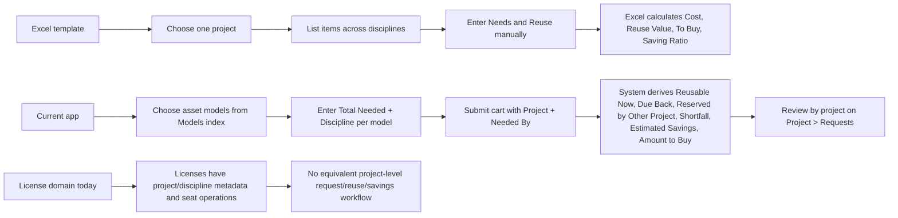

# Gap Analysis: Reuse Template.xlsx vs LEAMS/Snipe-IT Reuse Workflow

## Executive Summary
- The Excel template is a **project-level reuse decision tool** that combines disciplines, items, quantities, reuse assumptions, and financial outputs in one place.
- The application now provides a **strong asset-model workflow** for project-linked, discipline-aware reuse requests, including reuse estimation, due-back visibility, savings, and amount-to-buy calculations.
- The biggest current gap is that the workflow is **not symmetric across item types**: asset models are supported, but licenses do not yet participate in the same request / reuse / cost-comparison flow.
- A second gap is that the Excel template behaves like a **single mixed planning sheet**, while the application splits the experience across multiple screens and currently centers the planning workflow on models only.
- The application is already stronger than the spreadsheet in **traceability and workflow control** for asset models: saved requests, project review, request updates/cancelation, and operational inventory-based estimation.
- The highest-value next step is a **license-aware reuse/request flow** that mirrors the model workflow at the project + discipline level.

## Workbook Baseline
The workbook contains one sheet, `Reuse Template`, with these business concepts:

- one project context at the top
- discipline-based sections such as `Platform`, `Software`, `System`, and `Validation`
- an `Items` column that, in application terms, maps to:
  - asset models
  - licenses
- unit-price-based planning
- quantity needed
- quantity reused
- remaining quantity to buy
- section subtotals
- overall decision insights:
  - total cost
  - reuse value
  - to buy
  - saving ratio

## Process Comparison

## Gap Analysis Matrix

| Template Area | Item Type | Excel Template Behavior | Current App Behavior | Gap | Impact | Priority | Recommendation |
|---|---|---|---|---|---|---|---|
| Project context | Both | One project is chosen for the whole planning sheet. | Asset-model requests are project-linked and project review exists. Licenses also have `project_id` and appear on Project tabs, but not in the request workflow. | Partially Covered | Project context exists across both domains, but only models use it for reuse planning. | High | Keep project as the shared planning anchor and extend license planning into the same project-level flow. |
| Discipline segmentation | Both | Items are grouped under discipline-style sections. | Model requests are explicitly discipline-aware through `requested_discipline_id`. Licenses have `discipline_id` metadata, but no discipline-aware request planning. | Partially Covered | Discipline exists in the app, but only models use it operationally in planning. | High | Add discipline-aware planning for licenses and add discipline summary/grouping to project review. |
| Item catalog and object coverage | Both | `Items` can represent reusable tools/licenses without domain separation. | Models are requestable from the Models index. Licenses are managed and assignable, but not requestable via the same reuse-planning flow. | Partially Covered | The mixed-item nature of the workbook is not matched by the current app UX. | Critical | Introduce a unified reuse-planning concept that can handle both asset models and licenses. |
| Need quantity capture | Asset Model | User enters needed quantity per item. | The Models index supports `Total Needed` per row and cart submission. | Covered | Core quantity capture is present for models. | Low | Preserve this pattern. |
| Need quantity capture | License | User enters needed quantity per item. | Licenses do not currently support a planning/request quantity or seat-demand capture workflow. | Missing | This blocks workbook-equivalent planning for licenses. | Critical | Add quantity / seat-demand capture for licenses. |
| Reuse visibility | Asset Model | User enters reuse manually. | The app derives `Reusable Now`, `Due Back`, and `Reserved by Other Project` from live inventory state. | Covered Differently | Stronger than Excel operationally, but behavior differs from manual spreadsheet entry. | Medium | Document this as an intentional improvement, not a defect. |
| Reuse visibility | License | User can conceptually decide reuse vs buy. | No equivalent license-seat reuse estimation, due-back visibility, or reserved-by-other-project visibility exists. | Missing | License reuse cannot be evaluated in the same way as model reuse. | Critical | Add reusable-seat, allocated-seat, and remaining-seat calculations for license planning. |
| To Buy / shortfall logic | Asset Model | Remaining quantity to buy is visible. | `Shortfall` and `Amount to Buy` are computed and shown for model requests. | Covered | The core decision output exists for models. | Low | Preserve and refine presentation. |
| To Buy / shortfall logic | License | Remaining quantity to buy is visible. | No license planning shortfall or amount-to-buy calculation exists. | Missing | Workbook parity is not achievable for license items. | High | Add seat shortfall logic for licenses. |
| Financial calculation | Asset Model | Unit price drives cost, reuse value, and to-buy value. | `reference_price` supports `Estimated Savings` and `Amount to Buy` snapshots for model requests. | Covered | Financial comparison exists, though calculated from app-specific reuse logic. | Low | Preserve snapshot behavior and clarify it in UI/help text. |
| Financial calculation | License | Unit price drives cost, reuse value, and to-buy value. | Licenses have `purchase_cost`, but it is not used in a request/reuse/savings planning workflow. | Missing | The workbook’s financial planning model is absent for licenses. | High | Decide whether `purchase_cost` or a new planning price should drive license gap calculations. |
| Section subtotals | Both | Each discipline section has subtotal logic. | The app shows flat rows with discipline labels and project-level totals, but no discipline subtotal layer in the request review. | Partially Covered | Management can review rows, but not discipline-level subtotal blocks like the template. | Medium | Add optional grouping or subtotal-by-discipline in project request review. |
| Overall decision insights | Asset Model | Total cost, reuse value, to-buy, and saving ratio are summarized for the project. | Project `Requests` tab provides project-level request summary for models, including savings and amount to buy. | Partially Covered | Strong summary exists, but not all Excel metrics are mirrored 1:1 and it is model-only. | Medium | Add explicit total cost / reuse value / saving ratio equivalents if management needs spreadsheet parity. |
| Overall decision insights | License | Same overall decision view applies. | No project-level planning summary exists for license reuse decisions. | Missing | The workbook’s cross-item project summary is incomplete in the app. | High | Extend project request summaries to include licenses once the planning flow exists. |
| Workflow / usability | Both | One sheet captures project, disciplines, items, need, reuse, and decision outputs together. | The app uses a multi-screen workflow: Models index, cart, submitted requests, project requests tab, and separate license screens. | Covered Differently | The app is more operationally structured, but less “single-sheet immediate” than Excel. | Medium | Consider a future project planning workspace that combines models and licenses in one review surface. |
| Traceability / auditability | Asset Model | Spreadsheet is manual and weak on history. | The app stores requests, supports modify/cancel flows, and ties planning to live inventory state and project review. | Covered | Stronger than Excel in operational traceability. | Low | Keep as a differentiator in stakeholder messaging. |
| Traceability / auditability | License | Spreadsheet is manual and weak on history. | Licenses have operational seat management, but not the same request-planning audit trail. | Partially Covered | Operational history exists, but not planning history. | Medium | Add license planning records if license reuse workflow is introduced. |

## Key Findings

### Strongest Alignments
- The application now matches the workbook well for **asset-model demand capture**.
- The application exceeds the workbook for **live reuse estimation** on asset models because it derives values from actual inventory state.
- The application exceeds the workbook for **traceability**, since model requests are persisted, reviewable, and changeable.
- Project-level request review for models is a good foundation for management reporting.

### Biggest Gaps
- The workbook’s `Items` column is effectively **mixed-domain**, but the app’s planning workflow is currently **model-centric**.
- **Licenses** do not participate in the same request / reuse / savings workflow.
- The workbook’s **discipline subtotal** structure is not explicitly reflected in the current project request review.
- The workbook behaves like a **single decision sheet**, while the app spreads the process across several screens and tabs.

### Biggest Model-vs-License Asymmetries
- Models support request quantity, project, discipline, reuse estimation, savings, amount to buy, and project review.
- Licenses support metadata, project/discipline assignment, and seat checkout/checkin, but not comparable reuse-planning logic.
- The result is that the app currently supports the workbook **well for asset models** and **weakly for licenses**.

## Recommended Next Steps

### Quick Wins
- Add a discipline-grouped or subtotal-by-discipline option in project request review.
- Add explicit wording in management views to explain that model reuse is system-derived rather than manually entered.
- Decide whether management needs a visible `Saving Ratio` metric in addition to the existing money totals.

### Medium Changes
- Introduce a project-level planning view that can compare multiple disciplines more like the spreadsheet.
- Add project-level totals that more directly mirror the workbook:
  - total cost
  - reuse value
  - to buy
  - saving ratio

### Structural Gaps
- Design and implement a **license reuse/request planning workflow** parallel to the existing model request workflow.
- Create a unified planning experience that can handle both:
  - asset models
  - licenses
- Once both domains are supported, consider a **single project planning workspace** rather than separate model and license experiences.

## Appendix: Workbook Formula Notes
- `Cost` is driven by `Unit Price × Needs`.
- `Reuse Value` is driven by `Unit Price × Reuse`.
- `To Buy` is derived from the difference between total cost and reuse value.
- The workbook includes both section-level subtotals and an overall total row.
- The workbook’s `Saving Ratio` is a project-level normalized indicator that is not currently shown as such in the app.
